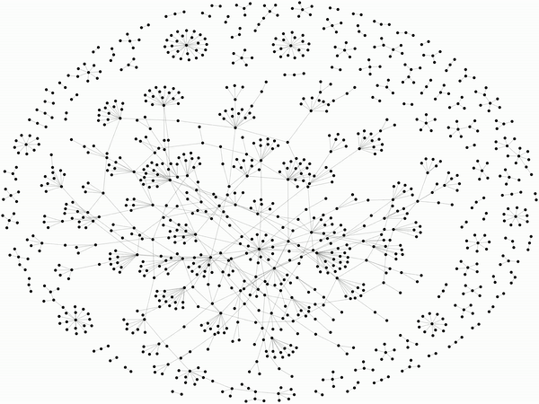

# Twitter Fake News Tracker

The prevalence of fake news is growing ever more apparent in today’s interconnected society. Fake news can lead to mass misinformation being spread to individuals in a population ultimately resulting in the truth being heavily distorted. Additionally, as a result of fake news, the underlying truth of a situation can be lost to such a degree that it is quite difficult for an individual to find an objective factual representation of the situation. By analyzing trends in the propagation of fake news over various social networks, we can develop a better understanding of the underlying causes and factors of fake news distribution.

This project creates a model for the proliferation of fake news over the social media platform Twitter. By tracking how a fake news story spreads through a social network's sub population, we can analyze the factors that affect how quickly a story spreads and how many users within the network that it can reach. The program demonstrates how penetration into seemingly disconnected networks is possible and made significantly easy with the large interconnected communities created by social media platforms.

## Network Flow Visualization

Website Host: https://harshilmodi10.github.io/Twitter_Fake_New_Model/

## Group Members
- [Justin Prez](https://github.com/justinprez)
- [Justin Rosner](https://github.com/justinrosner)
- [Akil Hamilton](https://github.com/akiljames83)
- [Harshil Modi](https://github.com/HarshilModi10)
- [Zac Demelo]()
